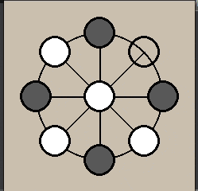

# Mu Torere 
PettingZoo env for Mū tōrere game.

## Game

Mū tōrere is a two-player board game played mainly by Māori people from New Zealand's North Island. Each player has four counters. The game has a simple premise but expert players are able to see up to 40 moves ahead. Like many other Māori board games, it is played on a papa tākoro (game board) and is tightly interwoven with stories and histories. [(wiki)](https://en.wikipedia.org/wiki/M%C5%AB_t%C5%8Drere)

### Rules

Mū tōrere is played on papa tākaro, or gameboards, or can be inscribed into clay or sand. The board is in the form of an eight-pointed star with endpoints, called kewai, connected to the center point, or pūtahi.

Each player controls four counters, or perepere, which are initially placed on the board at the kewai. At the beginning of the game the pūtahi is empty.

Players move one of their counters per turn to an empty point. Players can move only to an adjacent kewai, and can move to the pūtahi only when the moved counter is adjacent to an opponent's counter. The player who blocks all the opponent's counters from moving is the winner. 

## PettingZoo

[PettingZoo](https://www.pettingzoo.ml/) is a Python library for conducting research in multi-agent reinforcement learning, akin to a multi-agent version of [Gym](https://github.com/openai/gym).

## Mū tōrere env

Implemented env follows PettingZoo's AECEnv API and supports all required methods,
including render with pygame (see gif above).

Env supports 2 agents, first is playing white and second is playing black.
Observation comes in format of gym.spaces.Dict with 2 elements: "observation" and "action_mask".

"observation" is a numpy array of shape (n_kuwai + 1, 2), where [:, 0] is 
binary mask for agent's pawns and [:, 1] is binary mask for opponent's pawns.

"action_mask" is a numpy array of shape (n_kuwai + 1) and is binary mask indicating positions of pawns
agent is able to move in current turn.

Env supports any even number of kuwai with 8 set as default, but note that rendering is not optimized
for arbitrary number of kuwai.

## Q-learning example

qlearning.ipynb is a jupyter notebook with example on using Q-learning technique to learn how to play the game.
Refer to it to see example on env's API usage.

Q-learning requires estimating Q-values for each of the game states. Game with 8 kuwai has 630 different states,
but the game is very symmetric, this could be used to our advantage. By using rotations and mirroring I reduced number
of possible states to 46, and in practice agents use only up to 25.

The game is initially equal, so fully educated agents are able to play infinitely with each other. So for demonstration 
to have a chance to end I left 5% chance of a random move for each agent.
